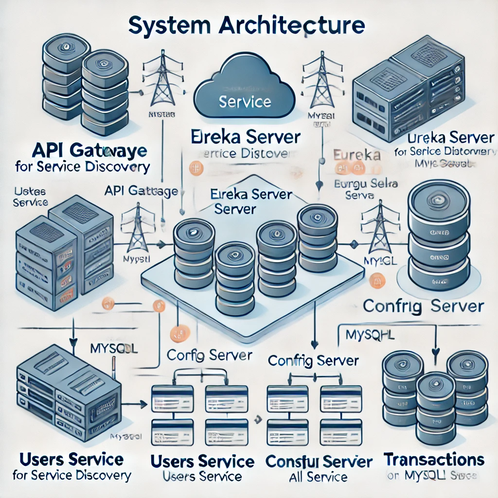

# 💳 Digital Money House (DMH)

Bienvenido a **Digital Money House (DMH)**, una solución backend diseñada para gestionar usuarios, transacciones y tarjetas, utilizando una arquitectura de microservicios. Este proyecto implementa una comunicación eficiente entre servicios, autenticación segura y manejo centralizado de configuración.

---

## 🛠️ Arquitectura del Sistema

### Diagrama de Componentes



### Descripción del Flujo

1. **API Gateway**
   - Encargado de redirigir las solicitudes al servicio correspondiente.
   - Gestiona la seguridad de las peticiones mediante validación de JWT.
2. **Eureka Server**
   - Actúa como el registro central de servicios, permitiendo el descubrimiento dinámico de microservicios.
3. **Config Server**
   - Centraliza y proporciona la configuración necesaria para todos los microservicios desde un repositorio remoto en GitHub.
4. **Users-Service**
   - Maneja el registro, autenticación y perfiles de usuarios.
5. **Cards-Service**
   - Gestiona el CRUD de tarjetas asociadas a cuentas de usuario.
6. **Transactions-Service**
   - Procesa transferencias, ingresos y consultas de saldo.

---

## 📂 Modelo de Base de Datos

### Diagrama Entidad-Relación (ERD)


### Tablas Principales:

1. **Users**: Información de los usuarios.
2. **Accounts**: Gestión de cuentas bancarias.
3. **Cards**: Administración de tarjetas.
4. **Activities**: Registro de transferencias e ingresos.

---

## 🚀 Endpoints Implementados

### **Users Service**
- **POST /api/register**: Registro de usuarios.
- **POST /api/login**: Inicio de sesión.
- **POST /api/logout**: Cierre de sesión.
- **GET /users/{id}**: Consulta de perfil.
- **PATCH /users/{id}**: Actualización de datos del perfil.

### **Cards Service**
- **GET /api/accounts/{accountId}/cards**: Obtener tarjetas de una cuenta.
- **POST /api/accounts/{accountId}/cards**: Crear tarjeta.
- **DELETE /api/accounts/{accountId}/cards/{cardId}**: Eliminar tarjeta.

### **Transactions Service**
- **GET /api/accounts/{id}/balance**: Consulta de saldo.
- **GET /api/accounts/{id}/activity**: Lista de actividades.
- **POST /api/accounts/{id}/transferences**: Registro de transferencias entre cuentas.

---

## 🔐 Seguridad

- **JWT (JSON Web Tokens)**: Implementado en todos los microservicios para asegurar las peticiones.
- **Roles y Permisos**: Acceso controlado según el rol del usuario.

---

## ⚙️ Configuración Centralizada

El **Config Server** gestiona las configuraciones de los microservicios desde un repositorio remoto. Las propiedades clave incluyen:

```properties
# Configuración de GitHub
spring.cloud.config.server.git.uri=https://github.com/Jfgazonb20/config-server.git
spring.cloud.config.server.git.username=username
spring.cloud.config.server.git.password=acceso_token
```

---

## 📋 Pruebas y Monitoreo

### Pruebas Automatizadas
- **Unitarias**: Pruebas detalladas de controladores y servicios en Users, Cards y Transactions.
- **De Integración**: Verificación del flujo completo entre microservicios a través del API Gateway.

### Monitoreo con Actuator
- **Actuator** habilitado para exponer métricas y salud de los servicios.
- URLs principales:
  - `/actuator/health`
  - `/actuator/info`

---

## 📥 Descargar Postman Collection

**Para probar los endpoints directamente, hemos proporcionado una Postman Collection lista para usar.**

[Descargar DMH Postman Collection](https://github.com/Jfgazonb20/DigitalMoneyHouseCol/raw/main/Pruebas_y_Flujo/DMHCERTIF.postman_collection.json)

### Cómo Importar la Collection

1. Descarga la colección desde el enlace proporcionado.
2. Abre Postman y selecciona **Importar**.
3. Arrastra y suelta el archivo `.json` descargado o selecciona el archivo desde tu explorador.

---

## 📊 Recursos Visuales Adicionales

1. **Diagrama de Flujo**: Representa la interacción entre los servicios y componentes.
2. **Modelo ERD**: Asegura la integridad y escalabilidad de la base de datos.

---

## 🌐 Cómo Ejecutar el Proyecto

1. Clona este repositorio:
   ```bash
   git clone https://github.com/Jfgazonb20/DigitalMoneyHouseCol.git
   ```
2. Navega al directorio de cada microservicio y ejecuta:
   ```bash
   mvn spring-boot:run
   ```
3. Asegúrate de que todos los servicios están registrados en **Eureka Server**.

---

Con este README, cualquier desarrollador puede comprender y contribuir al proyecto **Digital Money House (DMH)** de manera efectiva. ¡Gracias por tu interés en esta solución escalable y robusta!
